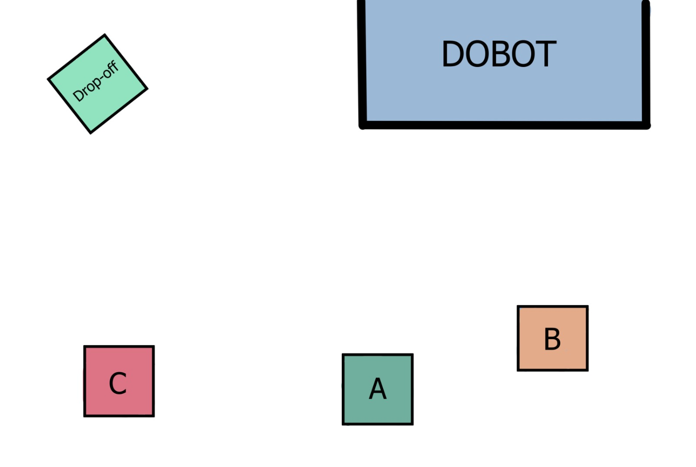
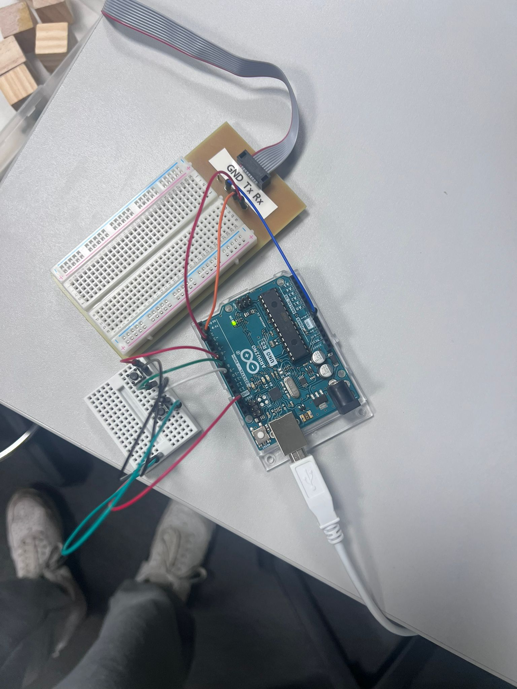

# Dobot Robotic Box Retriever

Arduino-controlled robotic box retrieval system using a **Dobot Magician** robotic arm and an **Arduino UNO**. Three push buttons select one of three predefined storage locations, after which the robot performs an automated pick-and-place sequence to move the selected wooden block to a common drop-off area.

## 🎥 Project Demonstration

The GIF below shows the completed robotic box retrieval system in operation. The Dobot follows the programmed movement sequence to approach the selected block, pick it up, transport it across the workspace, and release it at the designated drop-off area.

<p align="center">
  
</p>

## Project Overview

Developed for the **ELEE1144 Group Project**, this project demonstrates robotics, embedded programming and hardware integration. Each button corresponds to a different block location. The Arduino reads the selected input and sends a predefined sequence of command frames to the Dobot for pickup, transport and release.

## Hardware

- Dobot Magician robotic arm
- Arduino UNO
- Three push buttons
- Breadboard and jumper wires
- Wooden blocks
- Dobot pickup end effector

## How It Works

1. The Dobot is homed when the program starts.
2. The user selects a storage location using one of three buttons.
3. The Arduino identifies the selected input.
4. The corresponding movement sequence is sent to the Dobot.
5. The arm moves to the block and activates the pickup command.
6. The block is carried through programmed intermediate positions.
7. The arm moves to the common drop-off area and releases the block.
8. The system waits for another selection.

## Box Placement and Movement Planning

A placement sketch was created to define the positions of **Blocks A, B and C**, the **Dobot**, and the **drop-off area**. Keeping the physical layout consistent with the programmed positions helped improve repeatability and reduce positioning errors.



## Arduino Button Circuit

The Arduino UNO provides the input interface for the three selection buttons. The buttons use digital pins **7, 8 and 9**, with `INPUT_PULLUP` configured in the program. A shared ground connection was used for the button circuit.



## Software Design

The source code is stored in `src/BoxRetriever.ino`.

The program uses:

- `Dobot.h` for communication with the robotic arm
- Digital pins 7, 8 and 9 for the three selection buttons
- Predefined byte command frames for robot positions
- Homing, pickup and drop commands
- Separate movement sequences for each storage location
- Boolean execution flags to prevent a held input from repeatedly triggering the same sequence
- Timed delays between movement commands

## Testing

The system was developed and tested in stages. Testing focused on:

- Button input response
- Correct route selection
- Movement to each programmed storage position
- Successful pickup
- Movement to the delivery area
- Successful release
- Repeated execution of retrieval sequences

The placement sketch was used to reproduce the physical setup during testing.

## Challenges

### Time Constraints
Final integration and testing had to be completed within limited laboratory time, so the most important hardware and movement tests were prioritised.

### Finding the Buttons
Only one button was initially available even though the design required three. Additional buttons had to be sourced before the complete selection interface could be assembled.

### Homing Command Queue
The homing sequence required troubleshooting so that the Dobot started from a known position before executing retrieval commands.

### Connecting All Three Buttons to Ground
The team initially had difficulty determining how to connect all three buttons correctly to ground. A shared ground connection was used in the final circuit.

## Potential Improvements

- Use reusable functions to reduce repeated movement code.
- Replace fixed `delay()` calls with command-completion feedback or non-blocking timing.
- Add feedback to confirm that a block has been successfully picked up.
- Improve cable management and replace temporary breadboard wiring with a more permanent circuit.
- Add status LEDs or a display to show the selected storage location.
- Add object detection for a more autonomous system.

## Skills Demonstrated

`Arduino` · `C/C++` · `Robotics` · `Embedded Systems` · `Hardware Integration` · `Digital Inputs` · `Robot Motion Sequencing` · `Testing & Debugging`

## Repository Structure

```text
dobot-robotic-box-retriever/
├── README.md
├── src/
│   └── BoxRetriever.ino
├── assets/
│   └── images/
│       ├── box-placement-sketch.jpg
│       └── arduino-button-circuit.jpg
└── docs/
```

## Academic Context

This project was completed as part of the **ELEE1144 Group Project**. It was a collaborative engineering project, and this repository documents the robotic box-retrieval implementation and development work.
